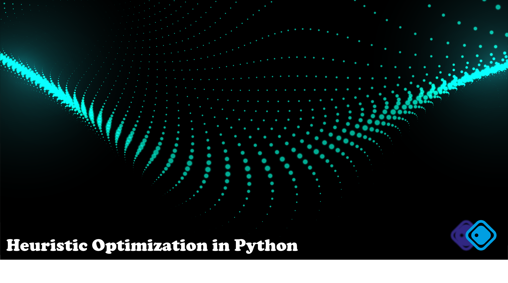

# 🐍Introduction

This repository contains original code samples of heuristic optimization or artificially intelligent algorithms and packages developed and maintained by Keivan Tafakkori.

What is unique about the designed algorithms is that they have been developed, keeping in mind the fact that Python is a loop-sensitive algorithm. Therefore, these codes can be much more computationally efficient while being applied to an optimization problem. On the other hand, the goal is to prepare a rapid prototype of such algorithms and promote their usage in, mainly but not limited to, industrial engineering (IE), optimization and operations research (OR), computer science (CS), data science (DS), machine learning (ML) and simulation (SM) fields.

Besides, some heuristic optimization packages are introduced which apply heuristic optimization algorithms right out of the box, and an example for using them is included.

# ❗Errors
If there are any code errors, please report issues or contact me. 

# 📃Current algorithms
1. ga: Genetic Algorithm (60 lines)
2. sa: Simulated Annealing (45 lines)
3. ts: Tabu Search (40 lines)

# 📃Current packages
1. geneticalgorithm: A package to apply the genetic algorithm
2. pyswarms: A package to apply the particle swarm optimization algorithm

# ❓How to use algorithms?

Algorithms are being designed in an standalone format, even not requiring special packages, with only `numpy`. Therefore, using them can be easily done by refering to the commented parts. To visualize the results of heuristic optimization algorithms, just add `visualize.py` code to the end of them.

# ❓How to use packages?

To use the packages, first you need to install them. For installation, just run the `_install.py` code before using any.

# ⚡Support

This repository will be more and more complete over time.

Hence, it is kindly requested to support this work by giving a ⭐ to the repository to make it available for a broad range of audiences who are interested in using heuristic optimization techniques in the Python programming language.

# 💫 Stars

# 🌐 Website
https://ktafakkori.github.io 

